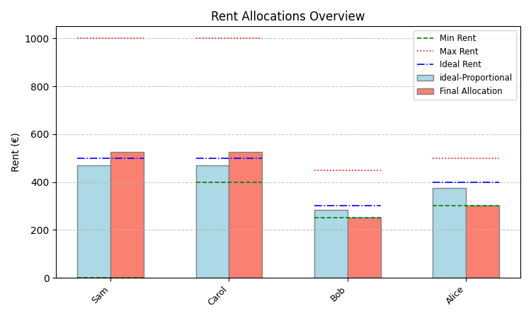
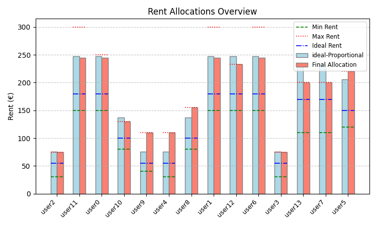
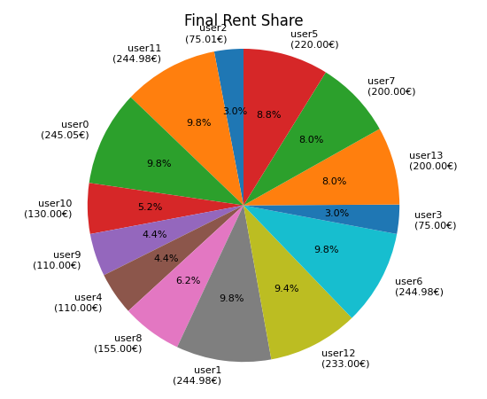
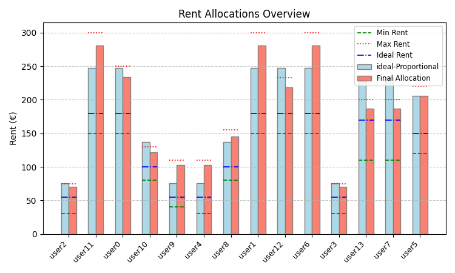

# Rent Allocation Tool

This tool calculates and visualizes rent allocations among multiple users based on configurable fairness and preference criteria. It uses convex optimization to balance between **equal rent sharing** and **preference-based rent sharing**, constrained by each user's **minimum**, **maximum**, and **target** rent contributions.

## Features

  * Graphical User Interface (GUI) built with **Tkinter**

  * **Alpha slider** to interpolate between fairness criteria:

      * `alpha = 0`: Equal rent split
      * `alpha = 1`: Preference-based split (emphasizing user-defined targets and max capacity)

  * Real-time optimization using **CVXPY**

  * Constraint-aware: respects user-defined min/max limits

  * Rent visualization with **Matplotlib** (bar chart & pie chart)

  * YAML-based input/output for easy configuration and persistence

-----

## Allocation Logic

### Inputs

Each user defines:

  * `min`: Minimum rent they are willing to pay
  * `max`: Maximum rent they can afford
  * `target`: Preferred or ideal rent contribution

The system also takes in:

  * `total_rent`: The full amount to be split
  * `alpha`: A slider value between 0 and 1 that blends allocation criteria

### Step-by-Step Allocation

1.  **Preference Score Computation**
    Each user gets a normalized **preference score** between 0 and 1 based on their target:

    $$
    $$$$\\text{score}\_i = \\frac{\\text{target}\_i - \\text{min}\_i}{\\text{max}\_i - \\text{min}\_i}

    $$
    $$$$These scores are adjusted to ensure users with **larger max capacity** contribute more as `alpha → 1`.

2.  **Blended Target Calculation**
    The system interpolates between equal share and preference-based targets:

    $$
    $$$$\\text{blended}\_i = (1 - \\alpha) \\cdot \\text{equal\_share} + \\alpha \\cdot \\text{weighted\_pref}\_i

    $$
    $$$$Where `weighted_pref_i` biases allocations more heavily toward users with higher `max`.

3.  **Convex Optimization**
    Using `cvxpy`, the tool solves:

    ```
    minimize:    sum((allocation_i - blended_i)^2)
    subject to:  sum(allocation_i) == total_rent
                min_i <= allocation_i <= max_i
    ```

    If constraints are infeasible (e.g., sum of minimums \> total), appropriate warnings are shown and constraints are relaxed.

4.  **Rounding & Adjustment**
    Allocation results are rounded to 2 decimals and adjusted slightly to ensure the sum equals `total_rent`.

-----

## Directory Structure

The `result_test_X` directories contain the output of running the rent allocation tool with different configurations. Each sub-directory (e.g., `alpha0`, `alpha1`) corresponds to a specific `alpha` value used during the allocation process.

Within each `result_test_X/alphaY` directory, you'll find:

  * **`final_rent_allocations.yaml`**: A YAML file detailing the calculated rent for each user.
  * **`rent_allocation_barplot.png`**: A bar chart visualizing the rent allocated to each user.
  * **`rent_allocation_piechart.png`**: A pie chart showing the proportional rent share for each user.

-----

## Results and Examples

### `result_test_1`

This test case likely involved a scenario with four users (Alice, Bob, Carol, Sam) and a total rent of 1600.

#### `result_test_1/alpha0`

When `alpha = 0`, the rent is split equally among the users.

**`final_rent_allocations.yaml` content:**

```yaml
Sam: 400.0
Carol: 400.0
Bob: 400.0
Alice: 400.0
```


#### `result_test_1/alpha1`

When `alpha = 1`, the rent allocation shifts towards a preference-based split, likely influenced by user targets and maximum capacities.

**`final_rent_allocations.yaml` content:**

```yaml
Sam: 525.0
Carol: 525.0
Bob: 250.0
Alice: 300.0
```




Notice how Sam and Carol contribute significantly more, while Bob contributes the least, suggesting their preferences and capacities were factored in.

### `result_test_2`

This test case involved a larger number of users (user0 through user13) and demonstrates the tool's scalability.

#### `result_test_2/alpha0`

With `alpha = 0`, the total rent is distributed as equally as possible given the constraints.

**`final_rent_allocations.yaml` content:**

```yaml
user2: 75.01
user11: 244.98
user0: 245.05
user10: 130.0
user9: 110.0
user4: 110.0
user8: 155.0
user1: 244.98
user12: 233.0
user6: 244.98
user3: 75.0
user13: 200.0
user7: 200.0
user5: 220.0
```




#### `result_test_2/alpha1`

With `alpha = 1`, the allocations are further adjusted based on individual user preferences and capacities.

**`final_rent_allocations.yaml` content:**

```yaml
user2: 70.21000000000001
user11: 280.81
user0: 234.01
user10: 121.69
user9: 102.96
user4: 102.96
user8: 145.09
user1: 280.81
user12: 218.1
user6: 280.81
user3: 70.2
user13: 187.21
user7: 187.21
user5: 205.93
```




Here, you can observe shifts in rent amounts compared to `alpha=0`, indicating how individual targets and maximums influenced the final distribution. For instance, `user11` and `user1` now pay more, while `user2` and `user3` pay slightly less.

-----

## Getting Started

1.  **Install dependencies**

    ```bash
    pip install -r requirements.txt
    ```

2.  **Run the tool**

    ```bash
    python compute_rent_shares.py
    ```

3.  **Load a config** (YAML)

4.  **Adjust the slider**

5.  **Save results** or export visuals

-----

## License

MIT License